## iFlytek-NLPTask

> 2023-DataWhale-Camp, NLP方向

项目题目：
+ 基于论文摘要的文本分类与关键词抽取挑战赛算法挑战大赛
+ 关键词提取：根据摘要生成关键词
+ 文本分类：判断是否为医学 

提供模型：
+ 数学和词频统计：tfidf+逻辑回归
+ 机器学习训练：bert版
+ 大模型微调: chatglm+lora

#### 运行环境

+ Python 3.10.12
+ 根目录的requirements.txt或docx/.yaml的conda导出

#### 最后成绩

+ RK17，1200队报名，121队提交，17/121 = **14%左右**。

  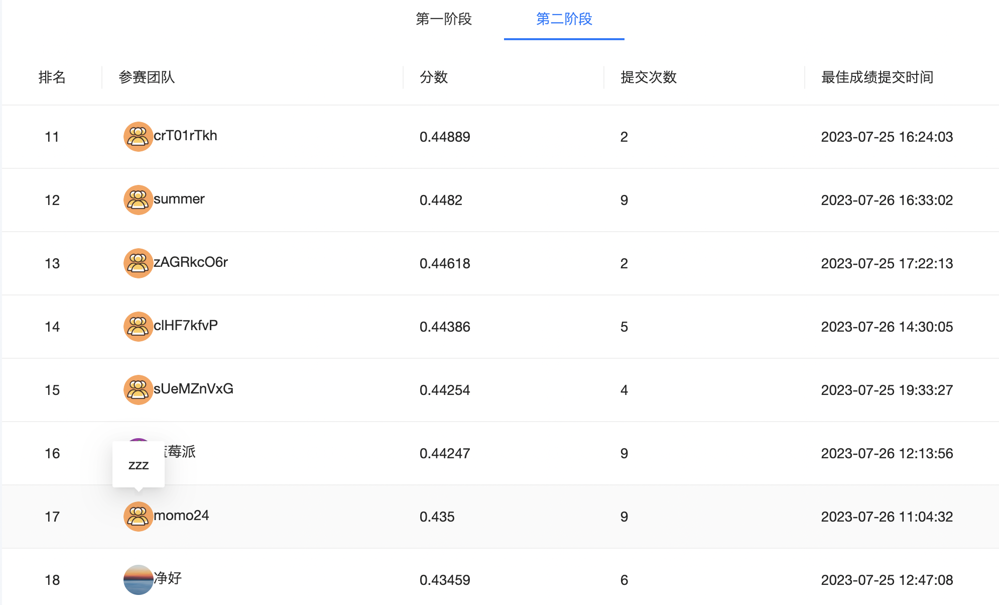

+ 分数：0.435    

  task1用微调的GLM大模型+bert补充。     

  task2用纯bert跑3轮。
  
  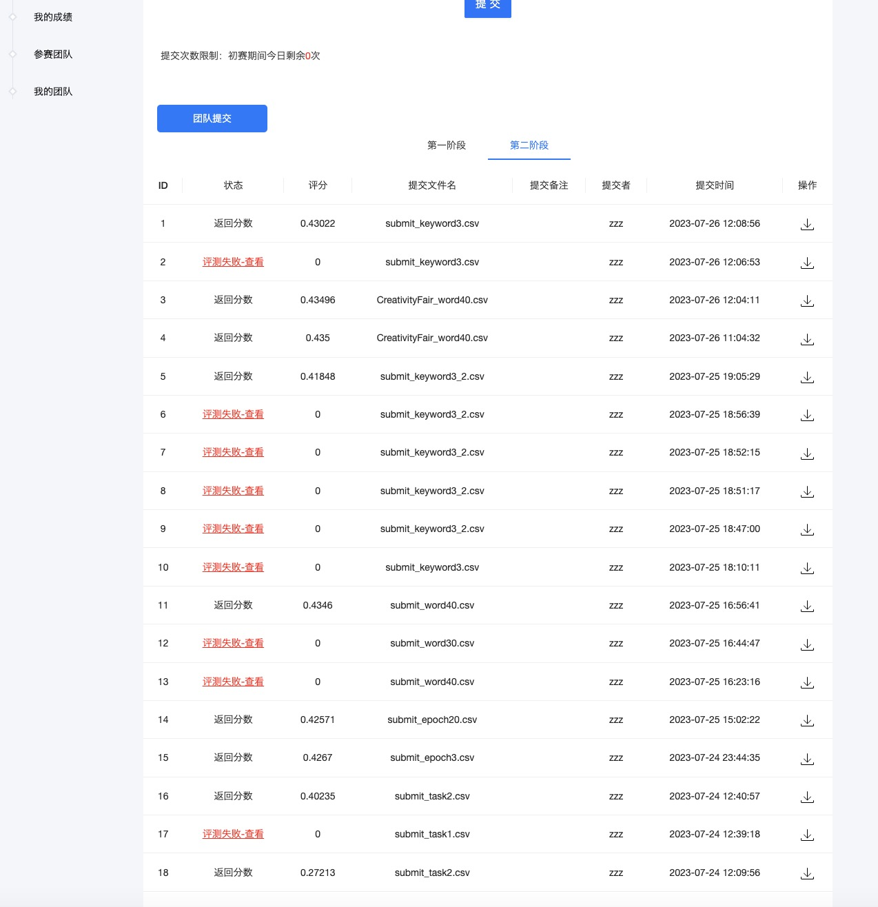

#### 运行笔记

NLP  bert版在线

+ 经过测试，百度飞桨无法使用torch，阿里云天池和谷歌Kaggle均无法联网从huggingface获得bert模型。
  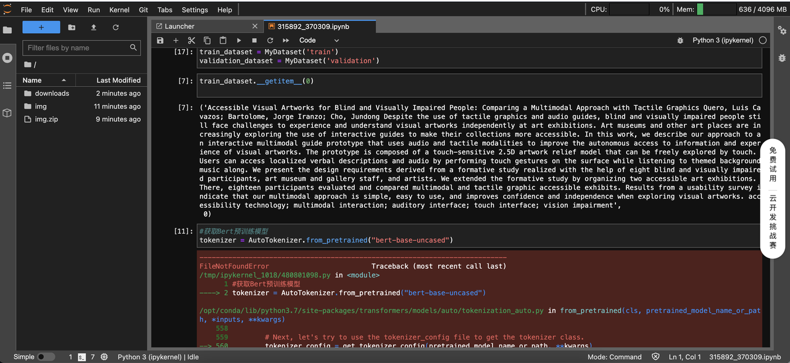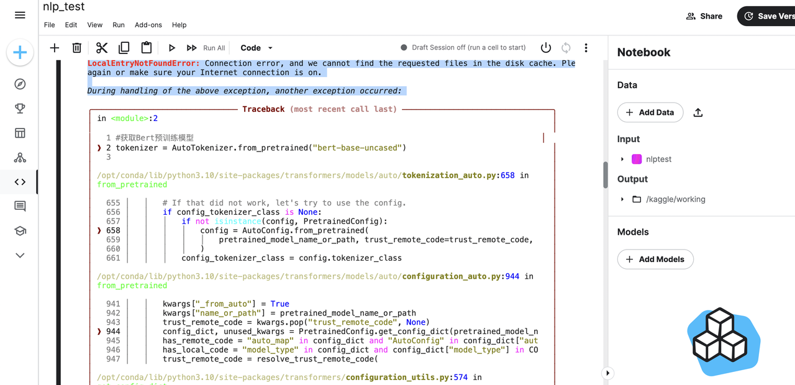

+ 最后使用Google Colab，手动安装transfrom后成功运行。
  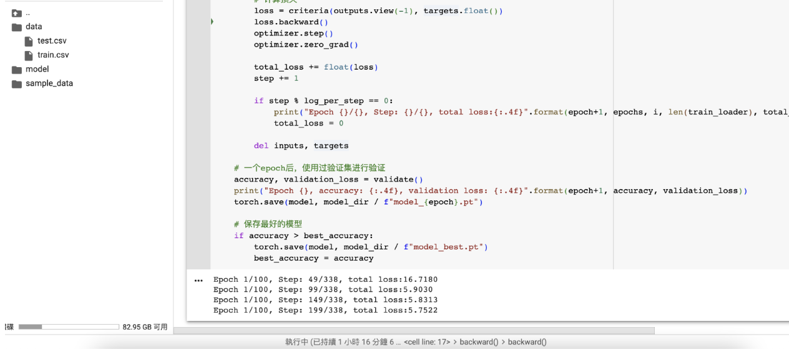
  
+ 本地也安装对应环境也可以跑，修改Epoch为1后，成功运行获得结果
  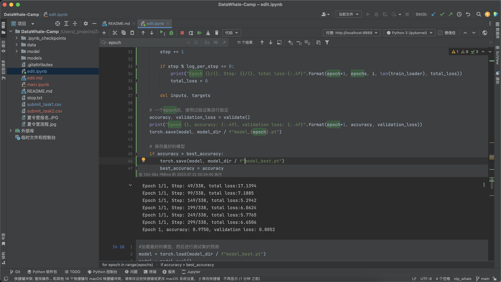

+ 提交后获得新的成绩。
  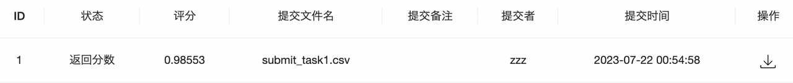
  
+ 使用m1pro运行36+18分钟，得到3轮epoch的bert，提交获得分数0.42670。

+ 租了个服务器E5，36核72线程，使用10轮epoch进行运行。

  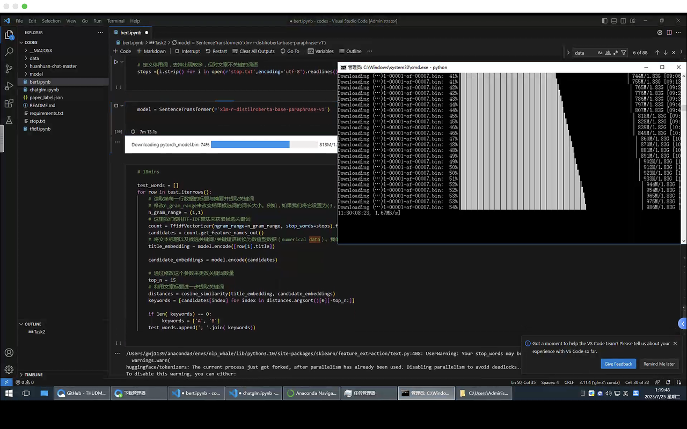
  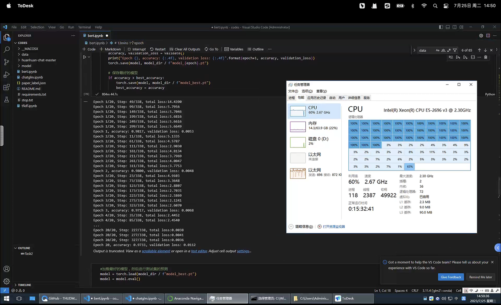

NLP  chatGLM+lora大模型

+ 搭建GLM环境
  微调脚本下载：https://github.com/KMnO4-zx/huanhuan-chat
  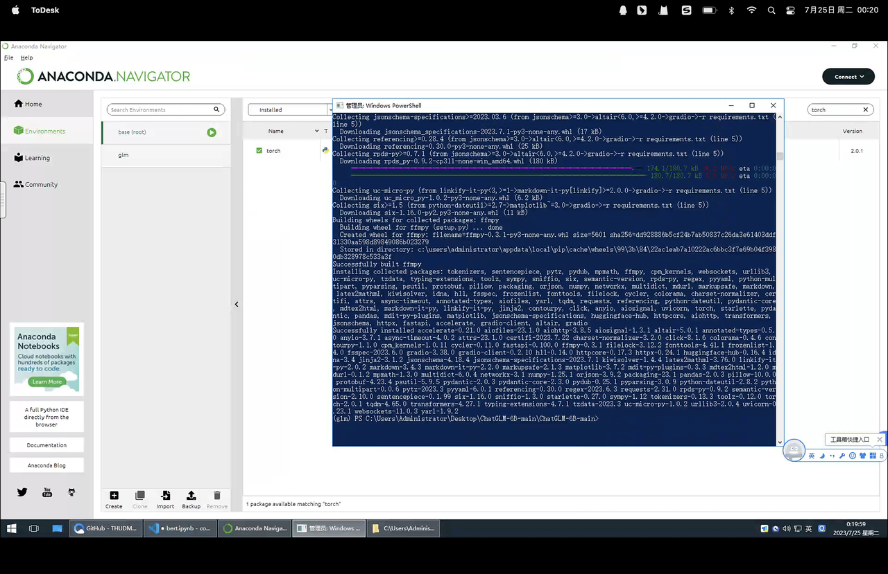
  
+ 大模型运行
  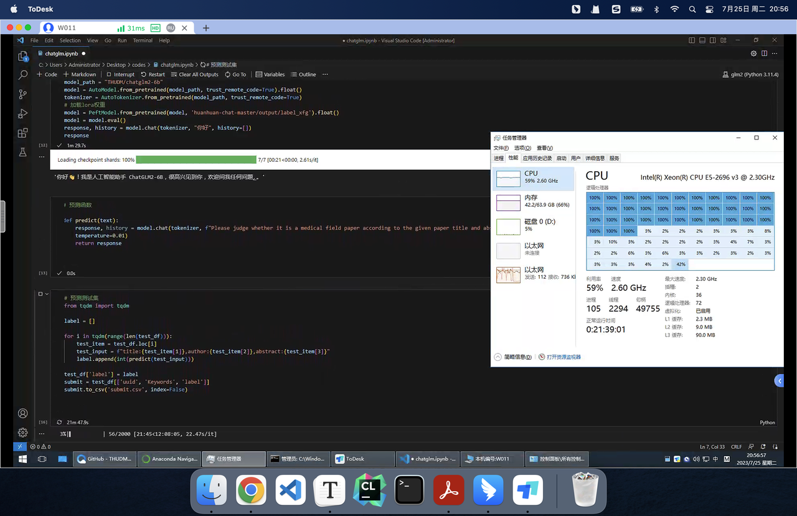
  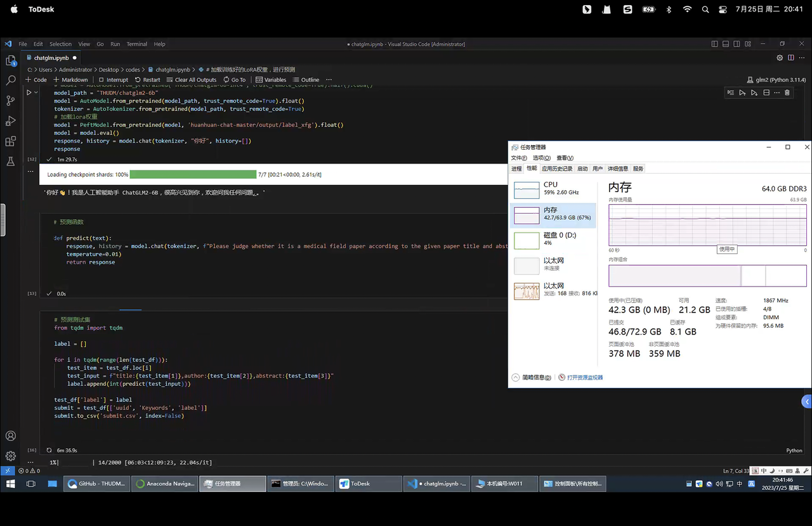
  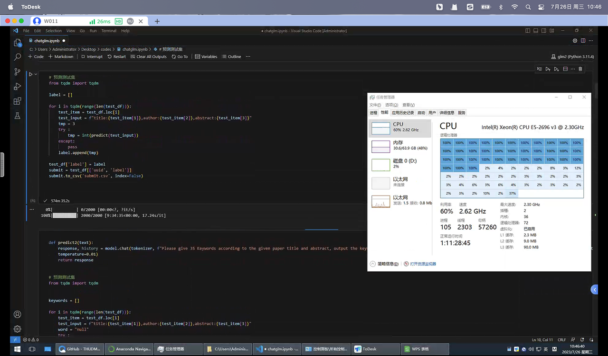
  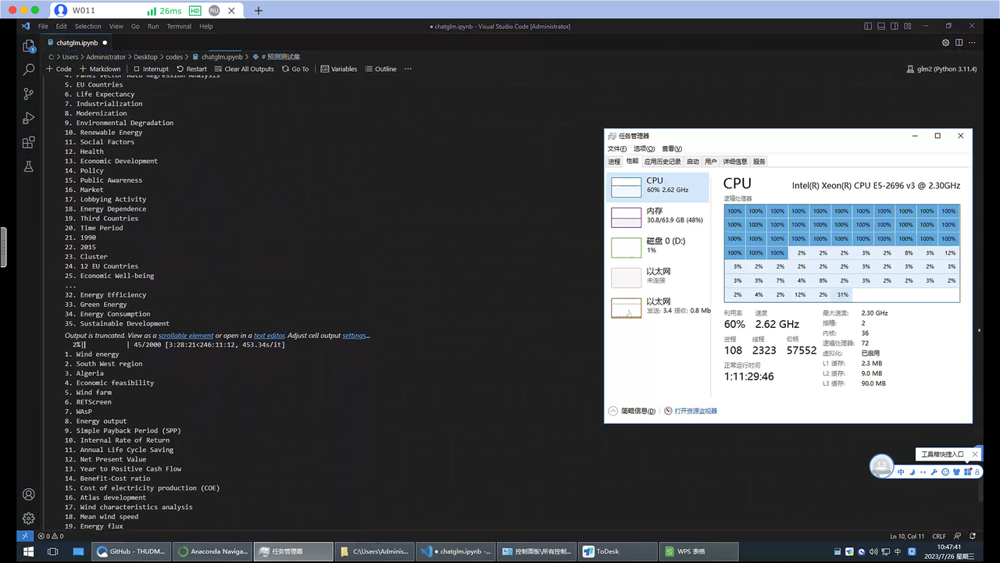

